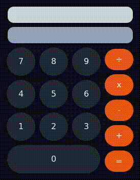

# ✨ Responsive Calculator with Next.js

I’ve built a feature-rich calculator using Next.js that seamlessly handles the four fundamental arithmetic operations:

➕ Addition | ➖ Subtraction | ✖️ Multiplication | ➗ Division

# 🎥 Demo: See the Calculator in Action!

A quick glimpse of the calculator's seamless functionality.

# 🔑 Key Features:

1. Dual Input Modes:
        Use your keyboard keys for quick number entry.
        Click on the onscreen buttons for intuitive interaction.

2. Responsive Design:
        Fully optimized for both desktop and mobile devices.

3. Smooth User Experience:
        Instant calculations with a clean and minimalist interface.

# 🚀 Why This Project?

This calculator was designed not only to perform basic operations but also as a demonstration of the power and flexibility of Next.js in creating dynamic, interactive applications.

Feel free to explore the code, try it out, and let me know your thoughts! 😊